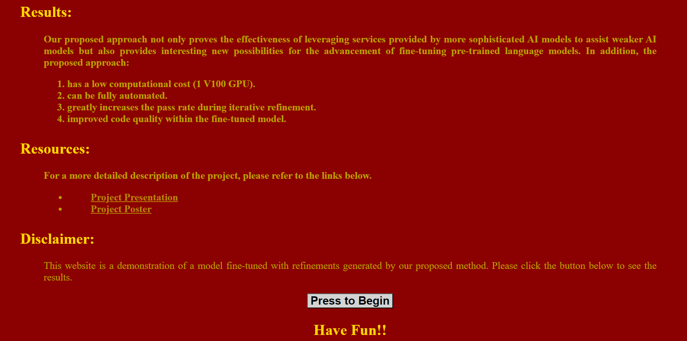

## Reference
https://github.com/nyu-mll/ILF-for-code-generation  
[Improving Code Generation by Training with Natural Language Feedback](https://arxiv.org/abs/2303.16749)  
[LeTI: Learning to Generate from Textual Interactions.](https://arxiv.org/abs/2305.10314)

## Slides & Poster
[Slides](https://www.canva.com/design/DAFlJjWlIxM/PxNXOFmaSOfViRpWfNtYWg/view)  
[Poster](https://www.canva.com/design/DAFlHMIIvQU/UV08fExZSFdzEHFtuKBJNg/view)
## Requirements
Ubuntu 22.04  
Python 3.7  
1 V100 GPU
## Installation
Unzip two zip files first  
Create virtual environment ilf & activate  

```
git clone git@github.com:HankStat/JH_seniorproj.git  
python3.7 -m venv ilf  
source ilf/bin/activate
```

Install all dependencies    
Download codgen-350M-mono  
Make sure that CUDA is compatible with PyTorch
```
pip install -r requirements.txt  
pip uninstall transformers  
pip install transformers  
pip install --upgrade accelerate  
```

## Methodology


## Dataset  
* ### Train
    * Prompt.txt   
    45 prompts from 9 different  programming categories (5 each)  
    * mbpp.jsonl (Mostly Basic Python Problems)  
    ID from 601 - 700
* ### Test
    * mbpp.jsonl (Mostly Basic Python Problems)  
    ID from 11 - 510

## Iterative feedback loop from train data
```
cd Manual_Iterative_Refinement
python iterative_querying.py
```
1. Ask ChatGPT : "Given the prompt: ..."  
Can you give me a list of steps without code to implement this in python. 
ChatGPT will give you the instructions for this prompt 
2. Enter the original prompt & press enter and Ctrl+D  
3. Return the output and Ask ChatGPT "Does this code work for  this task?    
If not, can you rewrite the steps of implementation and make it clearer?"

    The program will ask you "was this generation a success?"  

    If the code is correct &#8594; enter y in the console

    If the code is incorrect  &#8594; enter n in the console
4. Enter the instructions(updated) that ChatGPT generated 
5. Goto Step 3 until the code is correct or over five round 
6. If the code is correct after at least one round, you have to give the correct code segment to the program

## Finetune codegen350M-mono model
1. /Manual_Iterative_Refinement/InitialFail_but_Pass5 contains training data  
2. Use convert_txt_to_jsonl.py to convert txt to jsonl file
3. Fit data to codegen-350M-mono model  
```
python finetune.py  \
    --codegen_repo="Salesforce" \
    --do_train \
    --model_name_or_path=codegen-350M \
    --save_strategy=no \
    --num_train_epochs=2 \
    --learning_rate=5e-6 \
    --per_device_train_batch_size=4 \
    --gradient_accumulation_steps=32 \
    --logging_steps=1 \
    --output_dir "train_ifpu_v2" \
    --parallelize \
    --pad_to_max_length \
    --generation_max_length=512 \
    --max_seq_length=1024 \
    --max_answer_length=512 \
    --save_total_limit=2 \
    --parallelize \
    --prompt_column=prompt0 \
    --completion_column=success \
    --overwrite_output_dir \
    --train_file "train_ifpu_v2.jsonl"
```
## Get the reuslts from original model and finetuned model
```
# id from 11-510
python get_results.py task_id==id
```
## Demo (Win10 & Django)
Make sure that the finetuned model is in codegenerator/demo_app/train_ifpu_v2
```
cd Scripts
activate
cd ../
cd codegenerator
python manage.py runserver
# copy http://127.0.0.1:8000/ to Google Chrome
```
* ### Press to Begin


* ### Select Prompt


* ### Write your own prompt (You have to wait about three minutes after pressing submit button)


* ### Press Submit  
   Take "Write a function to find the perimeter of a square." for example  
* ### Results from original model

* ### Results from finetuned model


### Finetuned model generated correct result for this task and original model generated incorrect result
